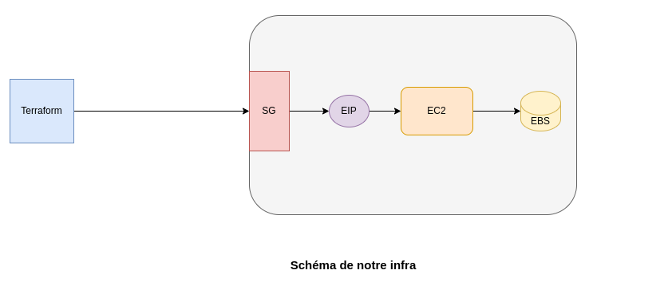
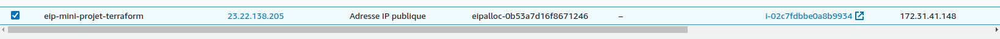
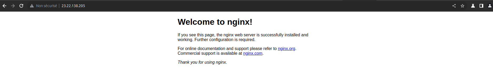

# mini-projet-terraform
<div align="left">
  
</div>

#
Ce Projet dénomé Mini Projet Terraform est mon projet de fin de formation sur le module **Terraform** dans le cadre du 15ième **Bootcamp Devops** *(Septembre à Novembre 2023)*.

## Objectifs

Il s'agit ici de :
- Ecrire un module terraform pour créer une instance **EC2** avec pour image la dernière version de *ubuntu bionic* rattachée à une **EBS et IP publique** dont le tag et la taille seront variabilisés
- Ecrire un module pour créer un volume **EBS** avec la taille à variabiliser
- Ecrire un module pour créer une **IP publique** qui s'attachera la **security group** 
- Ecrire un module pour la création d'une security group qui ouvrira les ports **80 et 443**
- Créer un dossier **app** qui va utiliser les 04 modules pour deployer une instance **EC2** à surcharger les variables.
- Installer **nginx** et enregistrer l'IP publique dans un fichier *ip_ec2.txt*

Au régard des objectifs cités plus haut notre infras ressemblera au schéma ci-dessous 
<div align="left">
  
</div>

##
# Prérequis

Pour atteindre les objectifs de cet projet nous aurons bésoin de:
- installer Terraform  dans l'environnement de travail (Ubuntu 23.04)
- d'un compte **AWS**  de type **AWS Identity and Access Management (IAM)** avec l'autorisation **AdministratorAccess**
- d'un **ACCESS KEY** et d'un **SECRET KEY** qui seront fourni à la création du compte **IAM**
- et d'une paire de clé **SSH** à créer dans le service **EC2**.

Nous pouvons directement passer à la partie `Terraform` en supposant que les Prérequis sont déjà remplis.

### **Étape 1: Organisation des dossiers**

Procédons à l'organisation de nos dossiers, pour ce faire nous allons créer les dossiers **app** et **modules** conformement aux objectifs.
- **app:**  ce dossier sera notre module racine
- **modules:** ce dossier sera composé de 04 sous-dossiers qui seront nos modules :*
 - `ec2` 
 - `ebs` 
 - `eip` 
 - `sg` 

Il faut noter que **Terraform** traite tout répertoire local référencé par l'argument `source` d'un bloc `module` comme un module.

 la structure de nos modules sera composé des fichiers suivants `main.tf`, `outputs.tf` et `variables.tf` 

Aucun de ces fichiers n'est requis ni n'a de signification particulière pour Terraform lorsqu'il utilise nos modules. on peut créer un module avec un seul fichier `.tf` ou utiliser toute autre structure de fichier de notre choix.

on va donc créer les fichiers  `main.tf` et `variables.tf` dans le dossier app et dans chaque sous-dossier du dossier module les fichiers `main.tf` ,`outputs.tf` et `variables.tf`.
### Création des dossiers et fichiers
```
gbane@dev-ops:~$ mkdir -p mini-projet-terraform && cd mini-projet-terraform 
gbane@dev-ops:~$ mkdir -p app modules/{ec2,eip,ebs,sg}
```
```
touch main.tf outputs.tf variables.tf 
gbane@dev-ops:~$ cp *.tf modules/ec2 
gbane@dev-ops:~$ cp main.tf outputs.tf modules/eip 
gbane@dev-ops:~$ cp *.tf modules/ebs
gbane@dev-ops:~$ mv *.tf modules/sg
```
### Structure des modules
```.
├── app
│   ├── main.tf
│   └── variables.tf
├── modules
│   ├── ebs
│   │   ├── main.tf
│   │   ├── outputs.tf
│   │   └── variables.tf
│   ├── ec2
│   │   ├── main.tf
│   │   ├── outputs.tf
│   │   └── variables.tf
│   ├── eip
│   │   ├── main.tf
│   │   └── outputs.tf
│   └── sg
│       ├── main.tf
│       ├── outputs.tf
│       └── variables.tf
├── README.md
└── screenshots
    ├── terraform-aws.png
    └── Terraform.png


```
##  Rôles des dossiers et Fichiers 
- ```app``` ce dossier est notre module racine, c'est à partir de lui que nos modules seront appelés, c'est aussi dans ce dossier que nos commandes **terraform** seront executées.
- ```modules``` c'est dans ce dossier que les modules pour **ec2**,**eip**, **ebs** et **sg** seront crées.

- ```main.tf``` contiendra la configuration principale de nos modules
- ```outputs.tf``` contiendra les définitions de nos modules qui sont mises à la disposition de la configuration à l'aide de l'argument `module`, elles sont utilisées pour transmettre des informations sur les parties de notre infrastructure définies par le module à d'autres parties de la configuration.

- ```variables.tf``` contiendra les définitions de variables pour nos modules. Lorsqu'un module est utilisé par d'autres, les variables seront configurées comme arguments dans le bloc `module`. ***Étant donné que toutes les valeurs Terraform doivent être définies, toutes les variables qui ne reçoivent pas de valeur par défaut deviendront des arguments obligatoires***. Les variables avec des valeurs par défaut peuvent également être fournies comme arguments de `module`, remplaçant la valeur par défaut

## Écriture des modules
###  1 - Le module de l'instance **EC2**
Nous allons travailler avec trois 03 fichiers de configuration terraform dans le sous-dossier ec2 de modules: `main.tf`, `outputs.tf` et `variables.tf`
```
├── ec2
│   ├── main.tf
│   ├── outputs.tf
│   └── variables.tf
```
**a -** ```modules/ec2/main.tf ```

créons dans le fichier `modules/ec2/main.tf` deux resources, une de type data source  appelée  ``data`` pour l'image ubuntu et une autre de type ```resource``` pour l'instance **ec2** 

Comme demandé dans l'enoncé ```nginx``` doit être installé et l'IP publique doit aussi être enregistré dans un fichier appelé ```ip_ec2.txt``` , pour ce faire nous allons ajouter deux ```provisioners``` de type  ``` remote-exec``` dans la section resource et de type  ```local-exec``` dans le module ```eip```

- ```local-exec``` permet d'executer une tâche à partir de l'hôte ou terraform est executé ici notre machine locale
- ```remote-exec``` permet d'executer une tâche sur l'hôte distant ici l'instance **ec2** en se connectant en ssh.

Il faut noter que le block `root_block_device` permet de supprimer le volume associé à notre **ec2** lorsque celui-ci sera supprimé.

- contenu du fichier main.tf
```
# Get latest Ubuntu Linux Bionic 18.04 AMI
data "aws_ami" "app_ami" {
  most_recent = true
  owners      = ["099720109477"] # Canonical
  filter {
    name   = "name"
    values = ["ubuntu/images/hvm-ssd/ubuntu-bionic-18.04-amd64-server-*"]
  }
  filter {
    name   = "virtualization-type"
    values = ["hvm"]
  }
}
# AWS EC2 resource
resource "aws_instance" "mini_projet_terraform" {
  ami             = data.aws_ami.app_ami.id
  instance_type   = var.aws_instancetype
  key_name        = var.aws_key_name
  tags            = var.aws_common_tag
  security_groups = ["${var.aws_sg_name}"]

  provisioner "local-exec" {
    command = "echo PUBLIC IP: ${self.public_ip} >> ip_ec2.txt"
  }

  provisioner "remote-exec" {
    inline = [ 
      "sudo apt  install -y nginx",
      "sudo systemctl enable nginx",
      "sudo systemctl start nginx",
      "sudo echo <center><h1>Hello Terraform!</h1></center> > /usr/share/nginx/html/index.html"
    ]
    connection {
    type = "ssh"
    user = var.username
    host = self.public_ip
    private_key = file("./files/${var.aws_key_name}.pem")
    }
  }
  
  root_block_device {
    delete_on_termination = true 
  }
}

```
- **b -** ```modules/ec2/outputs.tf```
à partir de ce fichier nous allons rendre disponible le ```id``` et la ```availability_zone``` de l'instance ec2 
```
output "ec2_id" {
  value = aws_instance.mini_projet_terraform.id
}

output "ec2_zone" {
  value = aws_instance.mini_projet_terraform.availability_zone
}
```
- **c -** ```modules/ec2/variables.tf```
Les variables définies dans ce fichier seront appelés dans le main.tf
```
variable "aws_instancetype" {
  type        = string
  description = "definir le type de l'instance"
  default     = "t2.nano"
}

variable "aws_common_tag" {
  type        = map
  description = "definir le tag de l'image"
  default = {
    Name = "ec2-mini-projet-terraform"
  }
}

variable "aws_key_name" {
  type    = string
  default = "devops-gbane.pem"
}

variable "aws_sg_name" {
  type        = string
  description = "Security Group"
  default     = "NULL"
}

variable "aws_public_ip" {
  type = string
  description = "set public ip"
  default = "eip-mini-projet-terraform"
}

variable "username" {
  type = string
  default = "ubuntu"
}
```
### 2 - Le module EBS 
Le module permettra d'attacher à notre instance un volume, il faut absolument que l'EBS et EC2 soit dans zone de disponibilité

le même principe que le module EC2 sera appliqué ici 
- **a -** ```modules/ebs/main.tf```
```
resource "aws_ebs_volume" "ec2_instance_ebs" {
  availability_zone = var.ebs_zone
  size              = var.ebs_size
  tags              = var.ebs_common_tag
}
```
```availability_zone```, ```size``` et ```tags``` sont variabilisés dans ```variables.tf```
- **b -** ```modules/ebs/variables.tf```
```
variable "ebs_zone" {
  type        = string
  description = "Set EBS Zone"
  default     = "us-east-1a"
}

variable "ebs_size" {
  type        = number
  description = "Set EBS Size"
  default     = 8
}


variable "ebs_common_tag" {
  type        = map
  description = "Set EBS Tag"
  default = {
    Name  = "ebs-mini-projet-terraform"
  }
}
```
- **c -** ```modules/ebs/outputs.tf```

```
output "ec2_ebs_id" {
  value = aws_ebs_volume.ec2_instance_ebs.id
}
```
on rend disponible le ```id``` de l'EBS pour qu'il soit utilisé par la resource ```aws_volume_attachment``` dans le ficher `app/main.tf`

### 3 - Module EIP
Le Module ```eip``` mettra a disposition de notre instance une adresse ip publique qui lui sera entièrement dediée. Raison pour laquelle le provisoner ```local-exec``` est executé ici

- **a -** ```modules/eip/main.tf```
```
resource "aws_eip" "ec2_lb" {
  domain   = "vpc"
  provisioner "local-exec" {
    command = "echo PUBLIC IP: ${self.public_ip} >> ip_ec2.txt"
  }
}
```
 
- **b -** ```modules/eip/outputs.tf```

on rend le ```id``` et ```public_ip```  disponible pour la resource ```aws_eip_association``` dans ```app/main.tf```
```
output "ec2_eip_id" {
  value = aws_eip.ec2_lb.id
}

output "ec2_eip" {
  value = aws_eip.ec2_lb.public_ip
}
```
### 4 - Security Group SG
La security group SG a pour rôle de contrôler le trafic autorisé à atteindre et à quitter les ressources auxquelles elle est associée.

- **a -** ```modules/sg/main.tf```
```
resource "aws_security_group" "allow_http_https_ssh" {
  name        = var.aws_sg_name
  description = "Allow HTTP inbound traffic"

  ingress {
    description      = "HTTP from VPC"
    from_port        = 80
    to_port          = 80
    protocol         = "tcp"
    cidr_blocks      = ["0.0.0.0/0"]
    ipv6_cidr_blocks = ["::/0"]
  }

  ingress {
    description      = "HTTPS from VPC"
    from_port        = 443
    to_port          = 443
    protocol         = "tcp"
    cidr_blocks      = ["0.0.0.0/0"]
    ipv6_cidr_blocks = ["::/0"]
  }

  ingress {
    description      = "SSH from VPC"
    from_port        = 22
    to_port          = 22
    protocol         = "tcp"
    cidr_blocks      = ["0.0.0.0/0"]
    ipv6_cidr_blocks = ["::/0"]
  }

  egress {
    from_port        = 0
    to_port          = 0
    protocol         = "-1"
    cidr_blocks      = ["0.0.0.0/0"]
    ipv6_cidr_blocks = ["::/0"]
  }

  tags = var.aws_sg_tag
}
```
ici seul les ```tags``` et ```name``` sont variabilisés , on aurait pu variabiliser ```from_port``` et ```to_port```.
Bien que n'étant pas demandé dans les objectifs on ouvre le **port 22** pour l'exection du remote-exec et on autorise l'instance à atteindre internet avec `egress` pour installer nginx

- **b -** ```modules/sg/variables.tf```
```
variable "aws_sg_name" {
  type        = string
  description = "set EC2 security group name"
  default     = "ec2-security-group"
}

variable "aws_sg_tag" {
  type        = map
  description = "set security group tag"
  default = {
    Name  = "ec2-security-group-tag"
  }
}
```
- **c -** ```modules/sg/outputs.tf```

```
output "ec2_security_group_id" {
  value = aws_security_group.allow_http_https_ssh.name
}
```
```allow_http_https_ssh.name``` sera rendu disponible pour être associé à l'instance avec l'attribut ```aws_sg_name```

### 5 - module racine app
Ce dossier est la racine du projet , c'est ici que seront executées les différentes commandes **terraform**
- contenu du dossier
```
├── app
│   ├── files
│   │   └── devops-gbane.pem
│   ├── main.tf
│   └── variables.tf
```
- **a -** ```app/main.tf```
```
provider "aws" {
  region     = var.aws_region
  access_key = var.aws_access_key
  secret_key = var.aws_secret_key
}

# Create EC2
module "ec2" {
  source = "../modules/ec2"
  aws_instancetype = "t2.micro"
  aws_sg_name = module.sg.ec2_security_group_id
  aws_public_ip = module.eip.ec2_eip
  
}

# Create EIP
module "eip" {
  source = "../modules/eip"

}

# Create EBS
module "ebs" {
  source = "../modules/ebs"
}
 
# Create Security Group
module "sg" {
  source = "../modules/sg"
}

resource "aws_volume_attachment" "ebs_att" {
  device_name = "/dev/sdh"
  volume_id   = module.ebs.ec2_ebs_id
  instance_id = module.ec2.ec2_id
}

resource "aws_eip_association" "eip_assoc" {
  instance_id   = module.ec2.ec2_id
  allocation_id = module.eip.ec2_eip_id
}
```
### Points clés du fichier
le ```provider``` permet de renseigner la configuration du cloud provider en specifiant la région et les paramètres de connexion  l'```access_key``` et le ```secret_key``` qui sont variabilisés.

**NB:** *une fois le provider est référencé à la racine, les autres modules en heritéront automatiquement, il n'est donc pas necéssaire de le faire dans les autres modules.* 

```module``` ce block permet charger les nouveaux modules dans le dossier racine et l'argument ```source``` dit où trouver ces modules.

```resource``` ce bloc permet d'associer les objets ```eip``` et ```ebs``` à l'instance **ec2** 

- **b -** ```app/variables.tf```

ce fichier contient les valeurs des éléments qui sont variabilisés (```region```, ```access_key``` et ```secret_key```)
```
variable "aws_region" {
  type        = string
  description = "set aws region"
  default     = "us-east-1"
}

variable "aws_access_key" {
  type    = string
  default = "la valeur de l'access_key"
}

variable "aws_secret_key" {
  type    = string
  default = "la valeur du secret_key"
}

```
- **c -** ```app/files/devops-gbane.pem```
ce fichier est la clé qui sera utilisée par le ``provisioner`` ```remote-exec``` pour se connecter en **ssh** pour installer nginx

## Exécution pour le provisionning 
### 1 - initilisation
L'initilisation permet de télécharger les plugins du provider necéssaires au deploiement et de charger nos modules. 

on se deplace dans le dossier **app** et lance la commande ci-dessous

```
$ terraform init 

Initializing the backend...
Initializing modules...
- ebs in ../modules/ebs
- ec2 in ../modules/ec2
- eip in ../modules/eip
- sg in ../modules/sg

Initializing provider plugins...
- Finding latest version of hashicorp/aws...
- Installing hashicorp/aws v5.31.0...
- Installed hashicorp/aws v5.31.0 (signed by HashiCorp)

Terraform has created a lock file .terraform.lock.hcl to record the provider
selections it made above. Include this file in your version control repository
so that Terraform can guarantee to make the same selections by default when
you run "terraform init" in the future.

Terraform has been successfully initialized!

You may now begin working with Terraform. Try running "terraform plan" to see
any changes that are required for your infrastructure. All Terraform commands
should now work.

If you ever set or change modules or backend configuration for Terraform,
rerun this command to reinitialize your working directory. If you forget, other
commands will detect it and remind you to do so if necessary.
```
l'Exécution de cette commande va créer un dossier ```.terraform``` dans lequel seront tous les plugins téléchargés.

### 2 - plan d'exécution
- terraform plan 
La commande terraform plan crée un plan d'exécution, qui permet de prévisualiser les modifications que Terraform prévoit d'apporter à l' infrastructure.

```
$ terraform plan
module.ec2.data.aws_ami.app_ami: Reading...
module.ec2.data.aws_ami.app_ami: Read complete after 1s [id=ami-055744c75048d8296]

Terraform used the selected providers to generate the following execution plan. Resource actions are indicated with the following symbols:
  + create

Terraform will perform the following actions:

  # aws_eip_association.eip_assoc will be created
  + resource "aws_eip_association" "eip_assoc" {
      + allocation_id        = (known after apply)
      + id                   = (known after apply)
      + instance_id          = (known after apply)
      + network_interface_id = (known after apply)
      + private_ip_address   = (known after apply)
      + public_ip            = (known after apply)
    }

  # aws_volume_attachment.ebs_att will be created
  + resource "aws_volume_attachment" "ebs_att" {
      + device_name = "/dev/sdh"
      + id          = (known after apply)
      + instance_id = (known after apply)
      + volume_id   = (known after apply)
    }

  # module.ebs.aws_ebs_volume.ec2_instance_ebs will be created
  + resource "aws_ebs_volume" "ec2_instance_ebs" {
      + arn               = (known after apply)
      + availability_zone = "us-east-1a"
      + encrypted         = (known after apply)
      + final_snapshot    = false
      + id                = (known after apply)
      + iops              = (known after apply)
      + kms_key_id        = (known after apply)
      + size              = 8
      + snapshot_id       = (known after apply)
      + tags              = {
          + "Name" = "ebs-mini-projet-terraform"
        }
      + tags_all          = {
          + "Name" = "ebs-mini-projet-terraform"
        }
      + throughput        = (known after apply)
      + type              = (known after apply)
    }

  # module.ec2.aws_instance.mini_projet_terraform will be created
  + resource "aws_instance" "mini_projet_terraform" {
      + ami                                  = "ami-055744c75048d8296"
      + arn                                  = (known after apply)
      + associate_public_ip_address          = (known after apply)
      + availability_zone                    = (known after apply)
      + cpu_core_count                       = (known after apply)
      + cpu_threads_per_core                 = (known after apply)
      + disable_api_stop                     = (known after apply)
      + disable_api_termination              = (known after apply)
      + ebs_optimized                        = (known after apply)
      + get_password_data                    = false
      + host_id                              = (known after apply)
      + host_resource_group_arn              = (known after apply)
      + iam_instance_profile                 = (known after apply)
      + id                                   = (known after apply)
      + instance_initiated_shutdown_behavior = (known after apply)
      + instance_lifecycle                   = (known after apply)
      + instance_state                       = (known after apply)
      + instance_type                        = "t2.micro"
      + ipv6_address_count                   = (known after apply)
      + ipv6_addresses                       = (known after apply)
      + key_name                             = "devops-gbane"
      + monitoring                           = (known after apply)
      + outpost_arn                          = (known after apply)
      + password_data                        = (known after apply)
      + placement_group                      = (known after apply)
      + placement_partition_number           = (known after apply)
      + primary_network_interface_id         = (known after apply)
      + private_dns                          = (known after apply)
      + private_ip                           = (known after apply)
      + public_dns                           = (known after apply)
      + public_ip                            = (known after apply)
      + secondary_private_ips                = (known after apply)
      + security_groups                      = [
          + "ec2-security-group",
        ]
      + source_dest_check                    = true
      + spot_instance_request_id             = (known after apply)
      + subnet_id                            = (known after apply)
      + tags                                 = {
          + "Name" = "ec2-mini-projet-terraform"
        }
      + tags_all                             = {
          + "Name" = "ec2-mini-projet-terraform"
        }
      + tenancy                              = (known after apply)
      + user_data                            = (known after apply)
      + user_data_base64                     = (known after apply)
      + user_data_replace_on_change          = false
      + vpc_security_group_ids               = (known after apply)

      + root_block_device {
          + delete_on_termination = true
          + device_name           = (known after apply)
          + encrypted             = (known after apply)
          + iops                  = (known after apply)
          + kms_key_id            = (known after apply)
          + throughput            = (known after apply)
          + volume_id             = (known after apply)
          + volume_size           = (known after apply)
          + volume_type           = (known after apply)
        }
    }

  # module.eip.aws_eip.ec2_lb will be created
  + resource "aws_eip" "ec2_lb" {
      + allocation_id        = (known after apply)
      + association_id       = (known after apply)
      + carrier_ip           = (known after apply)
      + customer_owned_ip    = (known after apply)
      + domain               = "vpc"
      + id                   = (known after apply)
      + instance             = (known after apply)
      + network_border_group = (known after apply)
      + network_interface    = (known after apply)
      + private_dns          = (known after apply)
      + private_ip           = (known after apply)
      + public_dns           = (known after apply)
      + public_ip            = (known after apply)
      + public_ipv4_pool     = (known after apply)
      + tags_all             = (known after apply)
      + vpc                  = (known after apply)
    }

  # module.sg.aws_security_group.allow_http_https_ssh will be created
  + resource "aws_security_group" "allow_http_https_ssh" {
      + arn                    = (known after apply)
      + description            = "Allow HTTP inbound traffic"
      + egress                 = [
          + {
              + cidr_blocks      = [
                  + "0.0.0.0/0",
                ]
              + description      = ""
              + from_port        = 0
              + ipv6_cidr_blocks = [
                  + "::/0",
                ]
              + prefix_list_ids  = []
              + protocol         = "-1"
              + security_groups  = []
              + self             = false
              + to_port          = 0
            },
        ]
      + id                     = (known after apply)
      + ingress                = [
          + {
              + cidr_blocks      = [
                  + "0.0.0.0/0",
                ]
              + description      = "HTTP from VPC"
              + from_port        = 80
              + ipv6_cidr_blocks = [
                  + "::/0",
                ]
              + prefix_list_ids  = []
              + protocol         = "tcp"
              + security_groups  = []
              + self             = false
              + to_port          = 80
            },
          + {
              + cidr_blocks      = [
                  + "0.0.0.0/0",
                ]
              + description      = "HTTPS from VPC"
              + from_port        = 443
              + ipv6_cidr_blocks = [
                  + "::/0",
                ]
              + prefix_list_ids  = []
              + protocol         = "tcp"
              + security_groups  = []
              + self             = false
              + to_port          = 443
            },
          + {
              + cidr_blocks      = [
                  + "0.0.0.0/0",
                ]
              + description      = "SSH from VPC"
              + from_port        = 22
              + ipv6_cidr_blocks = [
                  + "::/0",
                ]
              + prefix_list_ids  = []
              + protocol         = "tcp"
              + security_groups  = []
              + self             = false
              + to_port          = 22
            },
        ]
      + name                   = "ec2-security-group"
      + name_prefix            = (known after apply)
      + owner_id               = (known after apply)
      + revoke_rules_on_delete = false
      + tags                   = {
          + "Name" = "ec2-security-group-tag"
        }
      + tags_all               = {
          + "Name" = "ec2-security-group-tag"
        }
      + vpc_id                 = (known after apply)
    }

Plan: 6 to add, 0 to change, 0 to destroy.

──────────────────────────────────────────────────────────────────────────────────────────────────────────────────────────────────────────────────────────────────────────────────────────────────

Note: You didn't use the -out option to save this plan, so Terraform can't guarantee to take exactly these actions if you run "terraform apply" now
```
*comme on peut voir terraform prevoit l'ajout de 6 objets*

### 3 - Exécution
- terraform apply

La commande ```terraform apply``` exécute les actions proposées dans terraform plan cette action necéssite de confirmer l'exécution avec **```yes```**,  on peut aussi sauter cette étape avec l'option ```auto-approve```

**NB: l'éxecution de cette commande va créer le fichier ```terraform.tfstate```. c'est dans ce fichier que Terraform enregistre les informations sur les ressources qu'il a créées, c'est un fichier d'état. Cela permet à Terraform de savoir quelles ressources sont sous son contrôle et quand les mettre à jour et les détruire. Il est donc recommendé de le stocker à distance**
```
$ terraform apply 
module.ec2.data.aws_ami.app_ami: Reading...
module.ec2.data.aws_ami.app_ami: Read complete after 2s [id=ami-055744c75048d8296]

Terraform used the selected providers to generate the following execution plan. Resource actions are indicated with the following symbols:
  + create

Terraform will perform the following actions:

  # aws_eip_association.eip_assoc will be created
  + resource "aws_eip_association" "eip_assoc" {
      + allocation_id        = (known after apply)
      + id                   = (known after apply)
      + instance_id          = (known after apply)
      + network_interface_id = (known after apply)
      + private_ip_address   = (known after apply)
      + public_ip            = (known after apply)
    }
```
- création en cours
```
module.eip.aws_eip.ec2_lb: Creating...
module.ebs.aws_ebs_volume.ec2_instance_ebs: Creating...
module.sg.aws_security_group.allow_http_https_ssh: Creating...
module.eip.aws_eip.ec2_lb: Provisioning with 'local-exec'...
```
- local-exec en cours
```
module.eip.aws_eip.ec2_lb: Provisioning with 'local-exec'...
module.eip.aws_eip.ec2_lb (local-exec): Executing: ["/bin/sh" "-c" "echo PUBLIC IP: 23.22.138.205 >> ip_ec2.txt"]
```
- remote-exec en cours
```
module.ec2.aws_instance.mini_projet_terraform (remote-exec):   Target Platform: unix
module.ec2.aws_instance.mini_projet_terraform: Still creating... [1m20s elapsed]
module.ec2.aws_instance.mini_projet_terraform (remote-exec): Connected!
module.ec2.aws_instance.mini_projet_terraform (remote-exec): Reading package lists... 0%
module.ec2.aws_instance.mini_projet_terraform (remote-exec): Reading package lists... 100%
module.ec2.aws_instance.mini_projet_terraform (remote-exec): Reading package lists... Done
module.ec2.aws_instance.mini_projet_terraform (remote-exec): Building dependency tree... 0%
module.ec2.aws_instance.mini_projet_terraform (remote-exec): Building dependency tree... 0%
module.ec2.aws_instance.mini_projet_terraform (remote-exec): Building dependency tree... 50%
module.ec2.aws_instance.mini_projet_terraform (remote-exec): Building dependency tree... 50%
module.ec2.aws_instance.mini_projet_terraform (remote-exec): Building dependency tree

module.ec2.aws_instance.mini_projet_terraform (remote-exec): Reading state information... 0%
module.ec2.aws_instance.mini_projet_terraform (remote-exec): Reading state information... 0%
module.ec2.aws_instance.mini_projet_terraform (remote-exec): Reading state information... Done
```
- installation nginx 
```
Progress: [ 96%] [#################.] rraform (remote-exec): 
Progress: [ 97%] [#################.] rraform (remote-exec): Setting up nginx (1.14.0-0ubuntu1.11) ...
Progress: [ 99%] [#################.] rraform (remote-exec): Processing triggers for systemd (237-3ubuntu10.57) ...
module.ec2.aws_instance.mini_projet_terraform (remote-exec): Processing triggers for man-db (2.8.3-2ubuntu0.1) ...
module.ec2.aws_instance.mini_projet_terraform (remote-exec): Processing triggers for ufw (0.36-0ubuntu0.18.04.2) ...
module.ec2.aws_instance.mini_projet_terraform (remote-exec): Processing triggers for ureadahead (0.100.0-21) ...
module.ec2.aws_instance.mini_projet_terraform (remote-exec): Processing triggers for libc-bin (2.27-3ubuntu1.6) ...

module.ec2.aws_instance.mini_projet_terraform (remote-exec): Synchronizing state of nginx.service with SysV service script with /lib/systemd/systemd-sysv-install.
module.ec2.aws_instance.mini_projet_terraform (remote-exec): Executing: /lib/systemd/systemd-sysv-install enable nginx
```
- Fin du provisionning de l'instance ec2
```
module.ec2.aws_instance.mini_projet_terraform: Creation complete after 1m37s [id=i-02c7fdbbe0a8b9934]
aws_volume_attachment.ebs_att: Creating...
aws_eip_association.eip_assoc: Creating...
aws_eip_association.eip_assoc: Creation complete after 2s [id=eipassoc-08cc48cda7a2a34f9]
aws_volume_attachment.ebs_att: Still creating... [10s elapsed]
aws_volume_attachment.ebs_att: Still creating... [20s elapsed]
aws_volume_attachment.ebs_att: Creation complete after 22s [id=vai-1828829160]

Apply complete! Resources: 6 added, 0 changed, 0 destroyed.
```
### 4 - Vérification 
- **Création de l'EIP**
<div align="left">
  
</div>

- **Création de l'EBS**
<div align="left">
  
</div>

- **Création de la Security Group SG**
<div align="left">
  
</div>

- **Création de l'instance EC2**
<div align="left">
  
</div>

- **Installation de NGINX**
<div align="left">
  
</div>

- **Enregistrement de l'IP publique**
```
PUBLIC IP: 23.22.138.205
```
ceci étant on peut proceder à la suppression de nos objets **AWS** 
### 5 - Suppresion de l'instance
```
$ terraform destroy 
module.ec2.data.aws_ami.app_ami: Reading...
module.eip.aws_eip.ec2_lb: Refreshing state... [id=eipalloc-0b53a7d16f8671246]
module.ebs.aws_ebs_volume.ec2_instance_ebs: Refreshing state... [id=vol-062657401d18a34a2]
module.sg.aws_security_group.allow_http_https_ssh: Refreshing state... [id=sg-0228c4ac59395be1f]
module.ec2.data.aws_ami.app_ami: Read complete after 2s [id=ami-055744c75048d8296]
module.ec2.aws_instance.mini_projet_terraform: Refreshing state... [id=i-02c7fdbbe0a8b9934]
aws_volume_attachment.ebs_att: Refreshing state... [id=vai-1828829160]
aws_eip_association.eip_assoc: Refreshing state... [id=eipassoc-08cc48cda7a2a34f9]

Terraform used the selected providers to generate the following execution plan. Resource actions are indicated with the following symbols:
  - destroy

Terraform will perform the following actions:
```
cette commande permet de supprimer tous les objets crées avec la commande ```terraform apply``` en nous donnant une prévisualisation des objets à detruire

NB: *il faut aussi confirmer la destruction avec ```yes``` , on peut aussi sauter cette étape avec l'option ```auto-approve```

- Suppresion en cours
```
module.ebs.aws_ebs_volume.ec2_instance_ebs: Destroying... [id=vol-062657401d18a34a2]
module.ec2.aws_instance.mini_projet_terraform: Destroying... [id=i-02c7fdbbe0a8b9934]
module.ebs.aws_ebs_volume.ec2_instance_ebs: Still destroying... [id=vol-062657401d18a34a2, 10s elapsed]
module.ec2.aws_instance.mini_projet_terraform: Still destroying... [id=i-02c7fdbbe0a8b9934, 10s elapsed]
module.ebs.aws_ebs_volume.ec2_instance_ebs: Destruction complete after 11s
module.ec2.aws_instance.mini_projet_terraform: Still destroying... [id=i-02c7fdbbe0a8b9934, 20s elapsed]
module.ec2.aws_instance.mini_projet_terraform: Still destroying... [id=i-02c7fdbbe0a8b9934, 30s elapsed]
module.ec2.aws_instance.mini_projet_terraform: Still destroying... [id=i-02c7fdbbe0a8b9934, 40s elapsed]
module.ec2.aws_instance.mini_projet_terraform: Destruction complete after 43s
module.sg.aws_security_group.allow_http_https_ssh: Destroying... [id=sg-0228c4ac59395be1f]
module.sg.aws_security_group.allow_http_https_ssh: Destruction complete after 1s

Destroy complete! Resources: 6 destroyed.
```
# Conclusion
